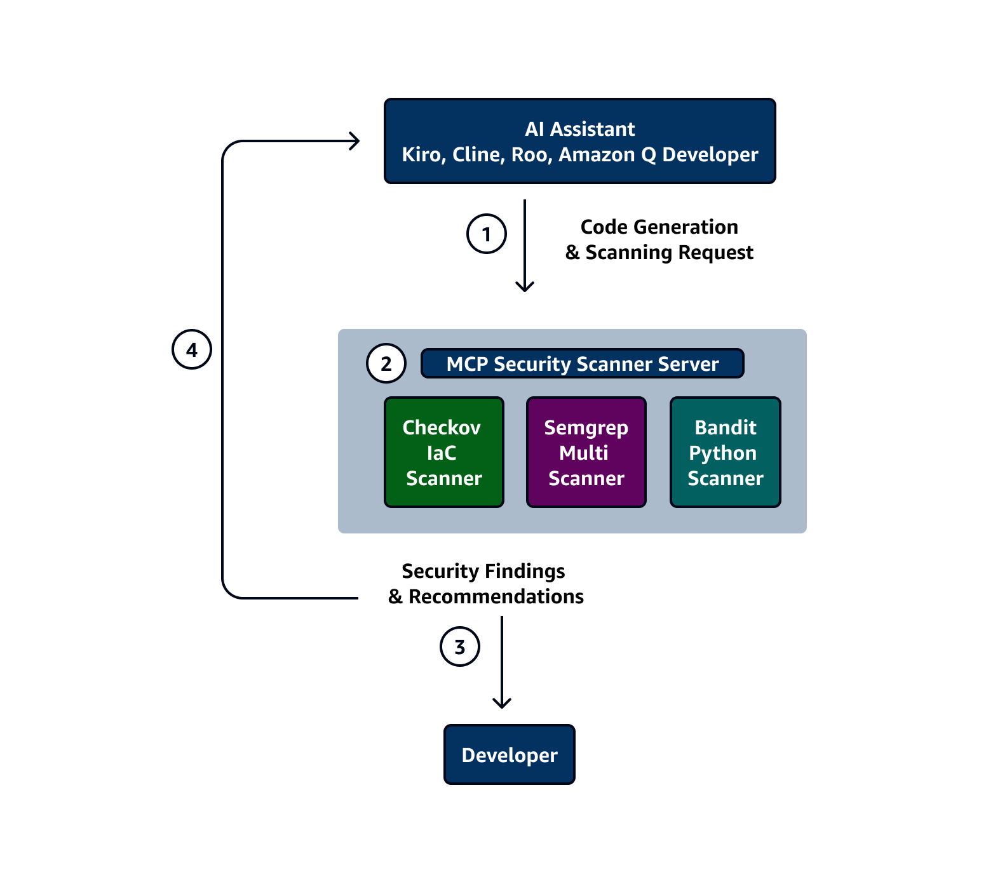

# MCP Security Scanner: Real-Time Protection for AI Code Assistants

This pattern describes how to implement a Model Context Protocol (MCP) server that integrates three industry-standard security scanning tools (Checkov, Semgrep, and Bandit) to provide comprehensive code security analysis. The server enables AI coding assistants to automatically scan code snippets and Infrastructure as Code (IaC) configurations for security vulnerabilities, misconfigurations, and compliance violations.

The solution combines Checkov for scanning IaC files (including Terraform, CloudFormation, and Kubernetes manifests), Semgrep for analyzing multiple programming languages (such as Python, JavaScript, Java, and others), and Bandit for specialized Python security scanning.

It provides a unified interface for security scanning with standardized response formats, making it easier to integrate security checks into development workflows. The pattern uses Python and the MCP framework to deliver automated security feedback, helping developers identify and address security issues early in the development process while learning about security best practices through detailed findings.

This pattern is particularly valuable for organizations looking to enhance their development security practices through AI-assisted coding tools, providing continuous security scanning capabilities across multiple programming languages and infrastructure definitions.

Key features:
 - Delta scanning of new code segments, reducing computational overhead
 - Isolated security tool environments preventing cross-tool contamination
 - Seamless integration with AI tools (Amazon Q Developer, Kiro, others)
 - Real-time security feedback during code generation
 - Customizable scanning rules for organizational compliance


## Demo

### Code Scanning Demo

Try these sample prompts with your AI assistant:
1. "Scan the current script and tell me the results"
2. "Scan lines 20-60 and tell me the results"
3. "Scan this Amazon DynamoDB table resource and tell me the result"


### Code Generation with Security Scanning Demo

Try these sample prompts to generate secure code:
1. "Generate a Terraform configuration to create a DynamoDB table with encryption enabled and scan it for security issues"
2. "Create a Python Lambda function that writes to DynamoDB and scan it for vulnerabilities"
3. "Generate a CloudFormation template for an S3 bucket with proper security settings and verify it passes security checks"
4. "Write a Python script to query DynamoDB with pagination and scan for security best practices"
5. "Create a Kubernetes deployment manifest for a microservice with security hardening and validate it"


## Architecture


## Features

This MCP server enables AI assistants to perform comprehensive security analysis on code snippets using three powerful security scanning tools:

### 🛡️ Checkov - Infrastructure as Code Security
- Scans Infrastructure as Code (IaC) files for security misconfigurations
- Supports: Terraform, CloudFormation, Kubernetes, Dockerfile, ARM, Bicep, and more
- Detects compliance violations and security best practices

### 🔍 Semgrep - Source Code Security  
- Analyzes source code for security vulnerabilities and bugs
- Supports: Python, JavaScript, TypeScript, Java, Go, C/C++, C#, Ruby, PHP, Scala, Kotlin, Rust
- Uses security-focused rulesets for comprehensive analysis

### 🐍 Bandit - Python Security Specialist
- Specialized Python security scanner
- Detects common Python security issues like insecure functions, hardcoded secrets, injection vulnerabilities
- Provides detailed confidence and severity ratings

## Installation

> **Note:** The following instructions are for macOS/Linux. For Windows and other code assistants, see the [AWS MCP Repository README](https://github.com/awslabs/mcp) for platform-specific instructions.

### Prerequisites
- Python >=3.10, <=3.13
- uv package manager (install from [Astral](https://docs.astral.sh/uv/getting-started/installation/))

### Local Installation

This MCP server is not available via PyPI and requires local download for enhanced security and control:

- **Security**: Verify the exact code you're running by inspecting the repository
- **Control**: Pin to specific versions and review changes before updating
- **Performance**: Local caching improves startup speed and reduces network dependencies
- **Trust**: Avoid potential package name confusion or use of unsecure mcp servers

1. **Clone or download the repository:**
```bash
git clone git@github.com:aws-samples/sample-mcp-security-scanner.git
cd sample-mcp-security-scanner
```
 
### Dependencies
The server automatically installs:
- `checkov>=3.0.0` - IaC security scanner
- `semgrep>=1.45.0` - Source code security scanner  
- `bandit>=1.7.5` - Python security scanner
- `mcp[cli]>=1.11.0` - MCP framework
- `pydantic>=1.10.0` - Data validation
- `loguru>=0.6.0` - Logging

## Usage

### MCP Configuration

After downloading the repository locally, configure your MCP client to use the server. The configuration varies by client.

### Getting Started with Kiro

<details>
<summary>Install in Kiro</summary>

See [Kiro Model Context Protocol Documentation](https://kiro.dev/docs/mcp/configuration/) for details.

1. Navigate `Kiro` > `MCP Servers`
2. Add a new MCP server by clicking the `Open MCP Config` button.
3. Paste the configuration below, replacing `/path/to/sample-mcp-security-scanner` with your actual repository path:

#### `.kiro/settings/mcp.json` (local) or `~/.kiro/settings/mcp.json` (global)

```json
{
  "mcpServers": {
    "security-scanner": {
      "command": "uvx",
      "args": [
        "--from",
        "/path/to/sample-mcp-security-scanner",
        "security_scanner_mcp_server"
      ],
      "env": {
        "FASTMCP_LOG_LEVEL": "ERROR"
      },
      "disabled": false,
      "autoApprove": []
    }
  }
}
```

</details>

### Getting Started with Amazon Q Developer

<details>
<summary>Install in Amazon Q Developer</summary>

See [Amazon Q Developer documentation](https://docs.aws.amazon.com/amazonq/latest/qdeveloper-ug/qdev-mcp.html) for details.

1. **Manual Configuration**
   - Edit the MCP configuration file at `~/.aws/amazonq/mcp.json` (global) or `.amazonq/mcp.json` (local).
   - Replace `/path/to/sample-mcp-security-scanner` with your actual repository path:

#### `~/.aws/amazonq/mcp.json`

```json
{
  "mcpServers": {
    "security-scanner": {
      "command": "uvx",
      "args": [
        "--from",
        "/path/to/sample-mcp-security-scanner",
        "security_scanner_mcp_server"
      ],
      "env": {
        "FASTMCP_LOG_LEVEL": "ERROR"
      }
    }
  }
}
```

</details>

### Getting Started with Cline

<details>
<summary>Install in Cline</summary>

1. Install the [Cline VS Code Extension](https://marketplace.visualstudio.com/items?itemName=saoudrizwan.claude-dev).
2. Click the extension to open it and select **MCP Servers**.
3. Select the **Installed** tab, then click **Configure MCP Servers** to open the `cline_mcp_settings.json` file.
4. Add the configuration below, replacing `/path/to/sample-mcp-security-scanner` with your actual repository path:

#### `cline_mcp_settings.json`

```json
{
  "mcpServers": {
    "security-scanner": {
      "command": "uvx",
      "args": [
        "--from",
        "/path/to/sample-mcp-security-scanner",
        "security_scanner_mcp_server"
      ],
      "env": {
        "FASTMCP_LOG_LEVEL": "ERROR"
      },
      "disabled": false,
      "autoApprove": []
    }
  }
}
```

</details>

### Other Code Assistants

For configuration instructions for Cursor, Windsurf, VS Code, Claude Desktop, and other MCP clients, see the [AWS MCP Repository README](https://github.com/awslabs/mcp).

### Available Tools

#### 1. `scan_with_checkov`
Scan Infrastructure as Code files for security issues.

**Parameters:**
- `code` (string): IaC content to scan
- `format_type` (string): Format type (terraform, cloudformation, kubernetes, dockerfile, etc.)

#### 2. `scan_with_semgrep`
Scan source code for security vulnerabilities.

**Parameters:**
- `code` (string): Source code content to scan
- `language` (string): Programming language (python, javascript, java, etc.)

#### 3. `scan_with_bandit`
Scan Python code for security issues (Python-specific).

**Parameters:**
- `code` (string): Python code content to scan

#### 4. `get_supported_formats`
Get information about supported formats and languages.

## Supported Formats

### Checkov (IaC)
- **terraform**: .tf, .tfvars, .tfstate
- **cloudformation**: .yaml, .yml, .json, .template  
- **kubernetes**: .yaml, .yml
- **dockerfile**: Dockerfile
- **arm**: .json (Azure Resource Manager)
- **bicep**: .bicep
- **serverless**: .yml, .yaml
- **helm**: .yaml, .yml, .tpl
- **github_actions**: .yml, .yaml
- **gitlab_ci**: .yml, .yaml
- **ansible**: .yml, .yaml

### Semgrep (Source Code)
- **python**: .py
- **javascript**: .js
- **typescript**: .ts
- **java**: .java
- **go**: .go
- **c**: .c
- **cpp**: .cpp
- **csharp**: .cs
- **ruby**: .rb
- **php**: .php
- **scala**: .scala
- **kotlin**: .kt
- **rust**: .rs

### Bandit (Python Only)
- **python**: .py files

## Response Format

All scanning tools return a consistent response format:

```json
{
  "success": true,
  "tool": "checkov|semgrep|bandit",
  "format_type": "terraform",
  "language": "python", 
  "total_issues": 3,
  "findings": [
    {
      "check_id": "CKV_AWS_20",
      "severity": "HIGH",
      "description": "S3 Bucket has an ACL defined which allows public access",
      "line_number": 3,
      "resource": "aws_s3_bucket.example"
    }
  ],
  "summary": {
    "high": 1,
    "medium": 2,
    "low": 0
  }
}
```

## Integration with AI Assistants

This MCP server is designed to work with AI coding assistants like Kiro, Amazon Q Developer, Cline and others. The AI can:

1. **Analyze generated code**: Automatically scan code snippets for security issues
2. **Provide context-aware suggestions**: Get language and format-specific security recommendations  
3. **Continuous security feedback**: Integrate security scanning into the development workflow
4. **Educational insights**: Learn about security best practices through detailed findings

## Development

### Running Locally
```bash
# Clone and install
git clone git@github.com:aws-samples/sample-mcp-security-scanner.git
cd sample-mcp-security-scanner
uv pip install -e .

# Run the server
python -m security_scanner_mcp_server.server
```

### Testing
```bash
# Test with sample code
python examples/test_scanner.py
```

## License

MIT License - see LICENSE file for details.

## Contributing

Contributions welcome! Please read CONTRIBUTING.md for guidelines.

## Security

This tool is designed to improve security by identifying vulnerabilities. However:
- Always review findings manually
- Keep scanning tools updated
- Use in conjunction with other security measures and tools

## Security

See [CONTRIBUTING](CONTRIBUTING.md#security-issue-notifications) for more information.

## License

This library is licensed under the MIT-0 License. See the LICENSE file.
